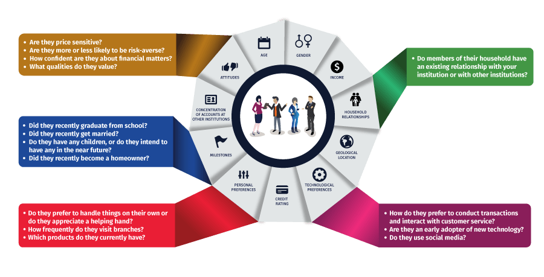

# Bank Customer Segmentation

## Context

Most banks have a large customer base - with different characteristics in terms of age, income, values, lifestyle, and more. Customer segmentation is the process of dividing a customer dataset into specific groups based on shared traits.

According to a report from Ernst & Young, “A more granular understanding of consumers is no longer a nice-to-have item, but a strategic and competitive imperative for banking providers. Customer understanding should be a living, breathing part of everyday business, with insights underpinning the full range of banking operations.

## About the Dataset

This dataset consists of 1 Million+ transaction by over 800K customers for a bank in India. The data contains information such as - customer age (DOB), location, gender, account balance at the time of the transaction, transaction details, transaction amount, etc.

## Dataset link

https://www.kaggle.com/datasets/shivamb/bank-customer-segmentation

## Technique use in Project

Exploratory data analysis.
 
Recency Frequency Monetary Analysis.
 
Feature Engineering.
 
T-SNE (Non-limear Dimensionality reduction Technique).
 
Machine Learning Algorithms.

